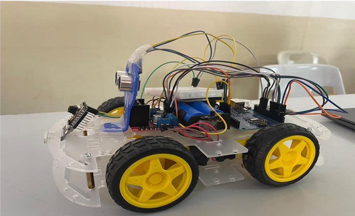
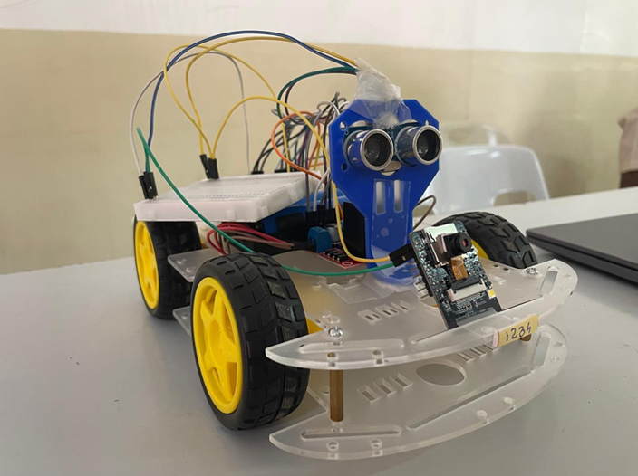
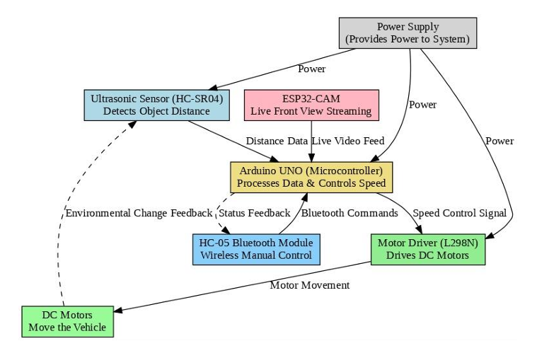
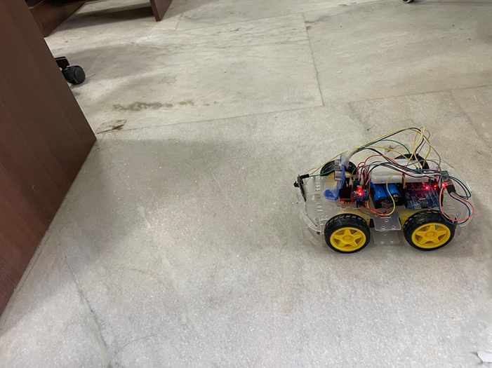
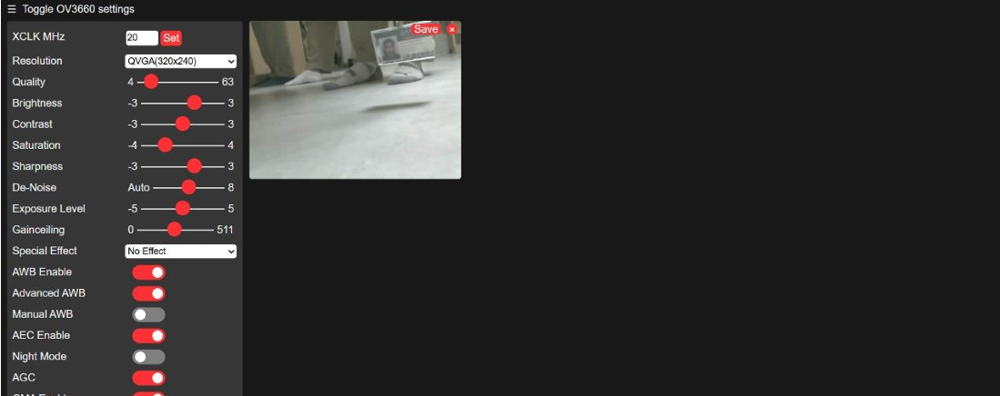
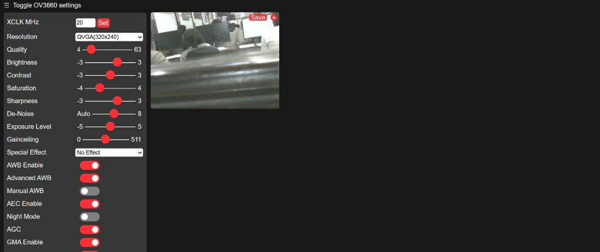

# Smart Car with Obstacle Detection, Adaptive Speed Control, and Real-Time Video Monitoring using ESP32-CAM

## Overview

This project presents a smart car capable of detecting obstacles and automatically adjusting its speed to improve safety. The system combines an Arduino Uno, an HC-SR04 ultrasonic sensor, an ESP32-CAM, and an L298N motor driver to provide obstacle detection, adaptive speed control, Bluetooth-based manual control, and real-time video monitoring.

> **Note:** This project was developed as a team project for academic purposes.

## Project Images

### Smart Car - Side View


### Smart Car - Front View


### System Block Diagram


### Object Detection Demo


### ESP32-CAM Live Stream




---

## Features

- Obstacle detection using the HC-SR04 ultrasonic sensor.
- Adaptive speed control based on the distance to obstacles.
- Automatic stopping when obstacles are too close.
- Bluetooth-based manual control.
- Real-time video monitoring using ESP32-CAM over Wi-Fi.

---

## Hardware Used

- Arduino Uno
- ESP32-CAM
- HC-SR04 Ultrasonic Sensor
- HC-05 Bluetooth Module
- L298N Motor Driver
- DC Motors
- Chassis and Wheels
- Battery Pack

---

## Software Used

- Arduino IDE
- Embedded C

---

## Working Principle

1. The HC-SR04 ultrasonic sensor continuously measures the distance to obstacles.
2. The Arduino Uno processes the measured distance and adjusts the motor speed accordingly (adaptive speed control).
3. As the vehicle approaches an obstacle, it gradually slows down. If the obstacle reaches the predefined safety threshold, the vehicle stops automatically.
4. Bluetooth commands allow manual movement of the vehicle.
5. The ESP32-CAM hosts a camera server and streams live video over Wi-Fi, enabling real-time monitoring of the vehicle's surroundings.

---

## Repository Structure

```
Arduino/        Arduino source code
ESP32-CAM/      ESP32-CAM source code
docs/           Project report
images/         Project images
diagrams/       Block and circuit diagrams
```

---

## Project Limitations

- The ESP32-CAM provides live video monitoring only.
- Video recording and storage were not implemented in this project.

---

## Team Project

This project was completed as part of a team for academic purposes.

### Team members
- Saketh Aryan Amineni
- Cherukuri Sri Nithya
- M. Janani Sree

---

## License

This project is intended for educational and learning purposes.